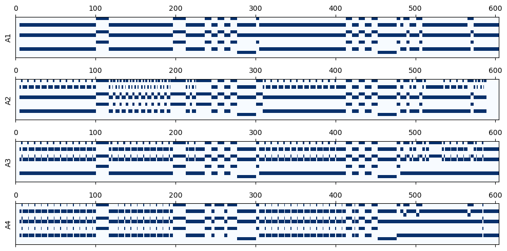
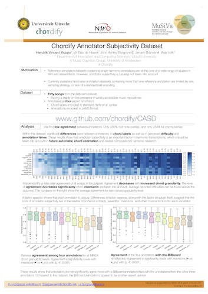
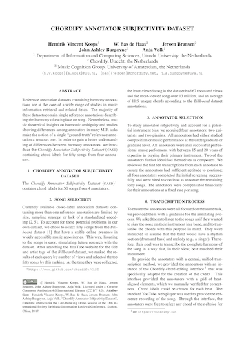

# Chordify Annotator Subjectivity Dataset

Reference annotation datasets containing single harmony annotations are at the core of a wide range of studies in Music Information Retrieval and related fields. However, a lot of properties of music are subjective, and **annotator subjectivity** found among multiple reference annotations is (usually) not taken into account. 

Currently available chord-label annotation datasets containing more than one reference annotation are limited by size, sampling strategy, or lack of a standardized encoding.

Therefore, to advance research into **annotator subjectivity** and computational harmony (such as Automatic Chord Estimation), we release the *Chordify Annotator Subjectivity Dataset (CASD)*, containing **multiple** expert reference annotations.

## Overview

This respository releases the **Chordify Annotator Subjectivity Dataset**, containing reference annotations for:

* **Fifty songs** from the [Billboard](http://ddmal.music.mcgill.ca/research/billboard) dataset [1] that
	* have a stable on-line presence in widely accessible music repositories
	* can be compared against the *Billboad* annotations
* Each song is annotated by **four expert annotators**
	* The annotations are encoded in [JAMS](https://github.com/marl/jams) format [2]
	* Chord labels are encoded in standard [Harte et al.](#references) syntax [3]
	* Annotations include *reported difficulty* (on a 5 point Likert scale, where 1 is easy and 5 is hard) and *annotation time* (in minutes) for each annotator
  
### How to access the annotations

(pip) install the [JAMS](https://github.com/marl/jams) python module to read the annotations. To work with the annotations, load an annotation file:

```
jam = jams.load('12.jams')
```

To access the annotations from the first annotator:

```
jam['annotations'][0]['data']
```

For further details on how to manupulate and work with JAMS files, we refer to the [JAMS documentation](http://pythonhosted.org/jams/index.html).

## Annotator Subjectivity

We find that within the CASD, annotators disagree about chord labels. The next figure gives a nice intuitive idea of the disagreement. 



This figure shows the [*chromagram*](https://en.wikipedia.org/wiki/Chroma_feature) of the annotators for song 92 in the dataset. The horizontal axis represents time, the vertical axis represents the 12 pitch classes of a single octave. The figure shows that the annotators differ in level of detail in time, as well as in pitch classes per chord. This figure was generated with [this script](misc/plot_chromas.py).

### Technical Report on Annotator Subjectivity

If you are interested in a detailed analysis of the annotator subjectivity found in the CASD, please find our technical report: 

Koops, H.V., de Haas, W.B., Burgoyne, J.A., Bransen, J., Volk, A.: [*"Technical Report: Harmonic Subjectivity in Popular Music."*](http://www.cs.uu.nl/research/techreps/repo/CS-2017/2017-018.pdf) Tech. Rep. UU-CS-2017-018, Department of Information and Computing Sciences, Utrecht University (2017)

See the [Utrecht University website](http://www.cs.uu.nl/research/techreps/UU-CS-2017-018.html) for more information.

If you want to cite this technical report, please use the following bibtex entry:

`@TECHREPORT{UUCS2017018,
author = {Koops, Hendrik~Vincent and Haas, Bas~de and Burgoyne, John~Ashley and Bransen, Jeroen and Volk, Anja},
year = 2017,
title = {Harmonic Subjectivity in Popular Music},
number = {UU-CS-2017-018},
institution = {Department of Information and Computing Sciences, Utrecht University},
urlpdf = {{http://www.cs.uu.nl/research/techreps/repo/CS-2017/2017-018.pdf}},
pubcat = {techreport}
}
`

A formal publication based on this technical report is underway.

## Contributing

By way of this repository and JAMS, we encourage the Music Information Retrieval community to exchange, update, and expand the dataset.

We are more than happy to add your annotations to this dataset. If you are interested in contributing, please keep in mind how these annotations were obtained (see: **Data collection method** below). Using the same data collection methods ensures keeping all the annotations in the dataset uniform and comparable.

To contribute, submit a pull request. Please send us an email for questions if you have questions on our code of conduct, of if the process for submitting pull requests is unclear.

## Data collection method

To ensure the annotators were all focused on the same task, we provided them
with a guideline for the annotating process. We asked them to listen to the
songs as if they wanted to play the song on their instrument in a band, and to
transcribe the chords with this purpose in mind. They were instructed to
assume that the band would have a rhythm section (drum and bass) and melody
instrument (e.g., a singer). Therefore, their goal was to transcribe the
complete harmony of the song in a way that, in their view, best matched their
instrument.

We used a web interface to provide the annotators with a central, unified
transcription method. This interface provided the annotators with a grid of
beat-aligned elements, which we manually verified for correctness. Chord
labels could be chosen for each beat. The standard YouTube web player was used
to provide the reference recording of the song. Through the interface, the
annotators were free to select any chord of their choice for each beat. While
transcribing, the annotators were able to watch and listen not only to the
YouTube video of the song, but also a synthesized version of their chord
transcription.

In addition to providing chords and information about their musical background,
we asked the annotators to provide for each song a difficulty rating on a scale
of 1 (easy) to 5 (hard), the amount of time it took them to annotate the song in
minutes, and any remarks they might have on the transcription process.

## Further Information

The *Chordify Annotator Subjectivity Dataset* was introduced at the late breaking session at the [18th International Society for Music Information Retrieval Conference](https://ismir2017.smcnus.org/). For more information about the CASD and annotator subjectivity in this dataset, please find the poster and extended abstract below.

[](img/ISMIR2017_LBposter.pdf)
[](https://ismir2017.smcnus.org/lbds/Koops2017.pdf)

## Authors

* **Hendrik Vincent Koops** - [Utrecht University](https://scholar.google.nl/citations?user=rzqMKygAAAAJ&hl)
* **W. Bas de Haas** - [Chordify](https://chordify.net)
* **Jeroen Bransen** - [Chordify](https://chordify.net)
* **John Ashley Burgoyne** - [University of Amsterdam](http://www.uva.nl/profiel/b/u/j.a.burgoyne/j.a.burgoyne.html)
* **Anja Volk** - [Utrecht University](http://www.staff.science.uu.nl/~fleis102/)

Questions can be addressed to [casd@chordify.net](mailto:casd@chordify.net).

## License


This work is licensed under a [Creative Commons Attribution-NonCommercial-ShareAlike 4.0 International License](https://creativecommons.org/licenses/by-nc-sa/4.0/).

## Acknowledgments

We thank all annotators for contributing to the project.

## References
[1] John Ashley Burgoyne, Jonathan Wild, and Ichiro Fujinaga, [*An Expert Ground Truth Set for Audio Chord Recognition and Music Analysis*](http://ismir2011.ismir.net/papers/OS8-1.pdf), in Proceedings of the 12th International Society for Music Information Retrieval Conference, pp. 633-38, 2011

[2] Humphrey, Eric J., Justin Salamon, Oriol Nieto, Jon Forsyth, Rachel M. Bittner, and Juan Pablo Bello. [*JAMS: A JSON Annotated Music Specification for Reproducible MIR Research.*](http://www.terasoft.com.tw/conf/ismir2014/proceedings/T106_355_Paper.pdf) In Proceedings of the International Society for Music Information Retrieval Conference, pp. 591-596, 2014.

[3] Harte, C., Sandler, M. B., Abdallah, S. A., & Gómez, E. [*Symbolic Representation of Musical Chords: A Proposed Syntax for Text Annotations.*](http://ismir2005.ismir.net/proceedings/1080.pdf) In Proceedings of the International Society for Music Information Retrieval Conference, pp. 66-71, 2005